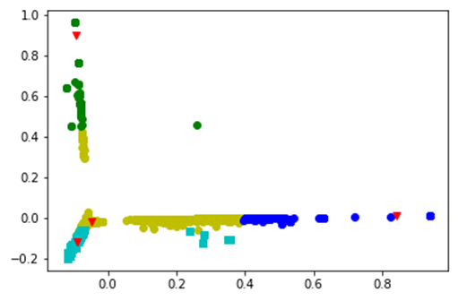
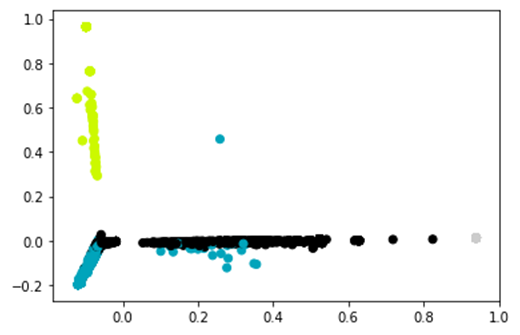
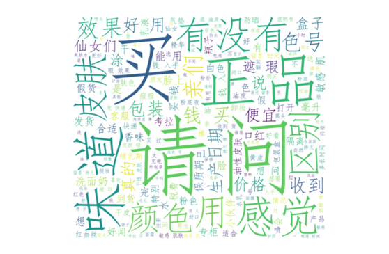

# 大数据技术与应用作业二实验报告

小组成员与分工：

王子旭：数据清洗         黄廷基：聚类与可视化 

贺嘉瑞：问题回答         张鑫钰、宋昕洋：数据分析、实验报告

------

### 1. 实验流程说明

#### 1.1 读取原始数据文件

采用pandas库可以直接读取csv数据文件，并查看数据各方面信息。

#### 1.2 数据清洗

（1）去停用词

根据网上常用的停用词库，使用jieba库中lcut函数分割文本，逐词判断并删除文本中停用词，同时采用jieba库的posseg函数对剩余有效文本数据进行词性分析，进一步筛选文本。

（2）去除特殊符号

调用pandas库函数去掉问题中’？’、标点符号、特殊符号等。

（3）去除异常文本

使用pandas库清理文本中空行、重复数据、仅含字母和数字的文本以及问题中小于三个字的行。

（4）生成tfidf矩阵

将处理后的文本数据按照初始顺序保存为.txt文件并输出所有统计词语的字典形式；调用sklearn库的TfidfVectorizer函数生成文本数据对应的tfidf矩阵。

#### 1.3 聚类

本次实验采用两种不同聚类方式，包括层次聚类与K-均值聚类，均可实现文本聚类目标。

1. 层次聚类

（1）采用主成分分析方法PCA对tfidf矩阵进行降维；

（2）调用AgglomerativeClustering库函数实现对数据的层次聚类；

（3）给聚类结果的簇贴标签以描述每个簇对应文本的中心话题；

（4）输出聚类结果的二维图像及运行时间。 

2. K-均值聚类

（1）使用PCA方法降维；

（2）调用KMeans库函数对降维后数据进行K-均值聚类；

（3）给聚类结果的簇贴标签以描述每个簇对应文本的中心话题；

（4）调用matplotlib绘制聚类结果二维图像，并确定各类中心点。

------

### 2.  实验结果分析

首先，依据上文中提到的聚类方法，我们选取了k-means聚类和Agglomerative clustering两种方法。下面两张图反映了**聚类后可视化**结果： 

下面两张图反映了聚类后可视化结果：

·k-means结果可视化：

·Agglomerative clustering结果可视化：

从结果中不难看出，两种方法的结果是极为相近的，从一定程度上说明了聚类结果的可靠性。这里我们将k-means为例，将聚类后的结果做成词云。

以下是四类文本中使用的词语组成的词云：

**类别一：**

词云如下图所示，词频较高的词语有：“请问”、“买”、“正品”、“味道”、“感觉”、“有没有”等。

整体来看：该类别的问题主要围绕商品本身的类别、特征信息。

首先，这类问题中出现了大量美妆用品（即类别和功能信息），如：“乳液”、“气垫”、“洗面奶”、“遮瑕”、“防晒”、“隔离”、“精华”等等，这些词语很有可能就是商品名称的一部分，同时也解释说明了商品功能。

另一方面，这类词语还包含了大量的商品物理特征信息，如：“颜色”、“味道”、“感觉”等。具体而言，与颜色相关的词有：“白色”、“红色”、“哑光”等等；与味道相关的词语有“香”、“留香”、“好闻”等词语；与感觉相关的词语有“持久”、“合适”等。

**类别二：**

词云如下图所示，词频较高的词语有：“正品”、“便宜”、“请问”、“买”等。

整体来看：该类别的问题主要围绕商品的质量等信息。产品质量方面，主要有：“正品”、“包装”、“查”、“假货”、“差”等等。

**类别三：**

词云如下图所示，词频较高的词语有：“孕妇”、“能用”、“适合”等。

整体来看该类别的问题主要围绕特定人群的使用信息。

 

**类别四：**

词云如下图所示，词频较高的词语有：“适合”、“油皮”、“色号”、“肤色”等。

整体来看：该类别的问题主要围绕商品的适用情况。

这类问题主要是询问产品可能的适用情况，如“干皮”、“油皮”、“混合型”、“黄皮”等对应“皮肤”；“男生”、“女生”对应性别等。

### 

------

### 3. 问题分析

因为本次作业为文本数据，在进行聚类时，会有很多的语气词等会对聚类结果产生影响，所以要进行数据预处理。在数据清理过程时，使用停用词以及正则表达式对文本数据进行预处理，可以去除语气词等，此外，一开始将tfidf矩阵输出时文件很大，有400Mb，打开后很多数据都是0，后来察觉到需要对数据进行降维。

------

### 4. 问题思考

1、 答：层次聚类需要指定类间距，因为层次聚类分为自上而下和自下而上两种。自下而上过程，是将距离最近的两个簇合并，需要提前指定类间距，相当于设置合并的终止条件，否则就会不断合并为一个簇；自上而下亦然。K均值聚类需要提前设置聚类的数目，因为k均值聚类的过程是先选取点，然后找距离最近的为一个簇，然后更新，以每个簇的中心点为新的选取点进行聚类，最终收敛。

2、 答：层次聚类收敛速度慢，不适合数据量过大的样本；k均值聚类需要提前设置聚类个数，也不适合该样本。应该选取基于密度的聚类DBSCAN聚类方法对该数据集进行聚类分析。本例采用CV法来确定K值，具体而言，就是K值选取1到9，对九种结果计算误差平方和，选取最小的误差平方和对应K值。

3、 答：本例我们采用了层次聚类和K均值聚类两种方法，通过结果分析，发现层次聚类法的效果更好。

层次聚类优点：距离和规则的相似度容易定义，限制少；不需要预先制定聚类数；可以发现类的层次关系；可以聚类成其它形状。缺点：计算复杂度太高；奇异值也能产生很大影响；算法很可能聚类成链状。

K均值聚类优点：优点：简单，易于理解和实现；时间复杂度低。缺点：需要对均值给出定义,需要指定要聚类的数目；一些过大的异常值会带来很大影响；算法对初始选值敏感；适合球形聚类。

密度聚类优点：可以对任意形状的稠密数据集进行聚类；可以在聚类的同时发现异常点，对数据集中的异常点不敏感；聚类结果没有偏倚。缺点：如果样本集的密度不均匀、聚类间距差相差很大时，聚类质量较差，这时用DBSCAN聚类一般不适合如果样本集较大时，聚类收敛时间较长；调参相对于传统的K-Means之类的聚类算法稍复杂，不同的参数组合对最后的聚类效果有较大影响。

4、 答：不是所有数据集都适合聚类分析。对于一些没有明显特征差异的数据难以进行聚类分析。

5、 答：聚类结果好坏：主观：直接通过肉眼观察，可以大致得出数据集应该分成类的个数，通过观察算法运行结果进行比对就可以得出聚类结果的好坏，类内越紧密，类间距离越小则质量越高。

客观：可通过熵值来判断聚类结果的好坏。简单来讲，熵值就是去计算本聚类中数据属于其它聚类的概率，将所有的概率叠加起来就是熵，熵值越小，聚类效果越好。

------

### 5.实验结果总结

总体来看，这几类中都高频出现了“请问”、“有没有”等词语，主要原因是这些数据据来自提问，所以每个类中均有出现，可考虑屏蔽这类词以提高聚类的准确性。

从各类的结果来看，不同类别的问题有不同的倾向，虽然有一定的交叉，但不影响整体分析。

