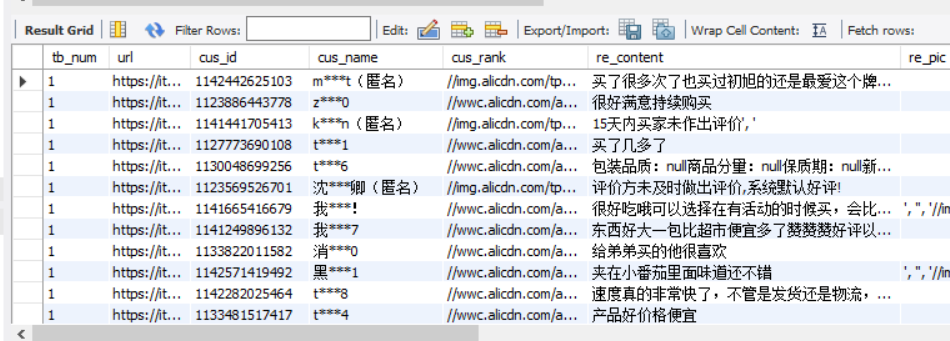
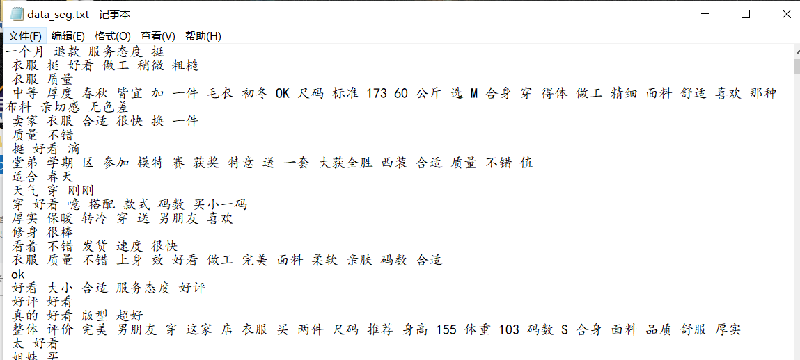
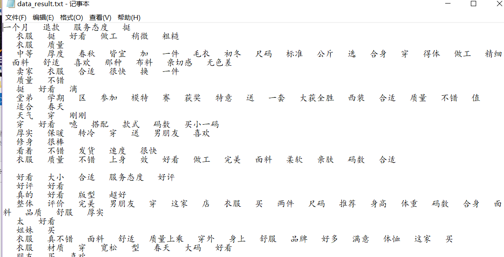
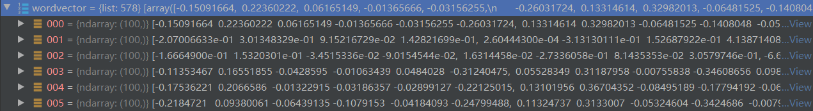
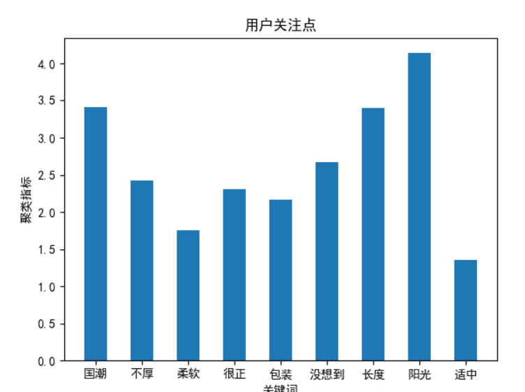

# Homework 3：挖掘用户关注  实验报告


Stu:      18级自动化 181870078 黄廷基

Date:	2021.8.9


------

### 1.  任务描述

#### 1.1 要求

> 针对淘宝平台中部分商品的用户评论数据，分别使用文本关键词提取方法以及主题模型，提取其中的用户关注点。
>
> （1）关键词提取：对于所有数据，进行文本关键词提取，挖掘该品类整体
> 上用户所关注的焦点。
>
> （2）主题模型：面对浩如烟海的文档，把相似的文章聚合起来，并且提取
> 描述聚合后主题的重要关键词，通过主题模型，挖掘在该品类中用户关注的几个
> 主要话题及对应的话题内容。


#### 1.2 需求分析

- 选取数据：服装品类 + 自爬数据
- 关键词提取模型：Word2Vec + Kmeans
- 主题模型选择：LDA模型

------


### 2.  数据爬取

#### 2.1 运行环境

> 软件：Pycharm2020（Python 3.9）、MySQL Workbench
>
> 文件：data_get.py、taobaocookie.py、create_database.sql
>
> 扩展包：selenium、pymysql ......
>
> 模拟浏览器版本：Chrome/92.0.4515.131


#### 2.2 爬取数据展示




#### 2.3 一些修订

- data_get.py里面的pymysql.escape_string()方法，最新的版本需要 from pymysql.converters import escape_string 来直接调用.
- taobaocookie.py里，getTaobaoCookie()里循环的browser.quit()需要去掉，否则只爬取一条webdriver就关闭了.

------


### 3.  关键词提取——Word2Vec + Kmeans

#### 3.1 运行环境

> 软件：Pycharm2020（Python 3.9）
>
> 文件：word_break.py、get_vector.py、train_word2vec.py、get_keyword.py
>
> 扩展包：selenium、pymysql ......
>
> 模拟浏览器版本：Chrome/92.0.4515.131


#### 3.2 模块功能

```Python
## word_break.py：去除停用词
#  
## get_vector.py：jieba分词、去重等数据处理
#  
## train_word2vec.py：训练Word2Vec模型，得到词向量
#  
## get_keyword.py：进行Kmeans聚类，按照组内距离之和，得到Top3的关键词
#  
```


#### 3.3 结果展示

- 去除停用词结果：




- jieba分词、去重等数据处理结果：




- Word2Vec模型参数设置：

```python
model = Word2Vec(LineSentence(inp), window=5, vector_size=100, min_count=5, sg=1, hs=1, workers=25)
```

- Word2Vec词向量部分展示：




- Kmeans聚类中心 ： 

  ```
    ['国潮', '不厚', '柔软', '很正', '包装', '没想到', '长度', '阳光', '适中']
  ```

- 统计结果：

  

  

- 排除掉英文数字及语气词汇，可以看出关键词主要排序为：

  > 阳光 > 国潮 > 长度 > 不厚 > 很正 > 包装 > 柔软 > 适中
  

- 从评价关键词可以看出，消费者对服装商品主要的评价集中在衣服的款式、质量上，这与常理相符合。

------


### 4.  主题模型——LDA

#### 4.1 运行环境

> 软件：Pycharm2020（Python 3.9）
>
> 文件：lda.py
>
> 扩展包：gensim.models.ldamodel
>


#### 4.2 模型结果

- 数据使用第三部分中处理后的数据

- 模型参数设置：

  ```python
  dictionary = corpora.Dictionary(texts)
  corpus = [dictionary.doc2bow(text) for text in texts]
  
  lda = gensim.models.ldamodel.LdaModel(corpus=corpus, id2word=dictionary, num_topics=20)
  # 将单个主题作为格式化字符串
  # 返回：主题的字符串表示，如'-0.340 *“类别”+ 0.298 *“$ M $”+ 0.183 *“代数”+ ...“。
  # topicno：主题ID，这里是10
  # topn: 将使用的主题中的单词数
  print(lda.print_topic(10, topn=5))
  ```

- 模型输出结果：

  ```
  0.128*"好看" + 0.064*"衣服" + 0.045*"喜欢" + 0.032*"超级" + 0.028*"质量"
  ```

- 与上面第三节的关键词结果不同，主题模型呈现的结果显得更加“浓缩”，能直接指出了评价的主题为“衣服”、“质量”。

------


### 5.  总结与思考

#### 5.1 问题思考——应用场景

- 对于“消费者评价关键词”的任务需求，可应用到商家服务方面，比如：给商品智能取名，在商品后缀上添加评价关键词，更容易吸引消费者；
- 对于“评价主题”的任务，则可以用于平台智能筛选不相关评价，比如在数据中常常见到“这是一条凑字数的评价”类似的评论，可以通过每条评价与主题相关程度进行屏蔽等操作；


#### 5.2 不足与改进

- 数据清洗效果不够理想：在清洗时只保留了中文，但后来发现符号、英文字母并不是都没有意义，比如 ‘ nice ’、‘ ！’ 等，都表达了消费者的评价；（这可能需要增加模型难度来改进）
- 分词结果不好：本次作业是直接使用了中科院的中文分词，但在商品评价上直接使用有些欠妥，可能要考虑在此基础上进行一些更贴合场景的增删；